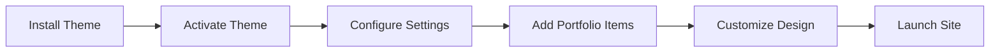

<div align="center">

# 🎨 Creative Agency Portfolio WordPress Theme

*Professional WordPress theme for creative agencies with portfolio showcase, WooCommerce support, and modern design*

[](https://github.com/MrShadowRIFAT/8DRY9UU-Creative_Agency_Portfolio_WP_Theme)


**Your creative empire starts here. WordPress-powered. Fully customizable.**

</div>

---

## ✨ Why This Theme

Transform your WordPress site into a stunning creative agency portfolio. Perfect for designers, photographers, agencies, and creative professionals. Built with modern WordPress standards and packed with agency-ready features.

---

## 🔥 Features

🎨 **Portfolio Showcase** – Custom post type for project display  
🛍️ **WooCommerce Ready** – Built-in e-commerce support  
📱 **Fully Responsive** – Mobile, tablet, desktop perfect  
🎯 **Modern Design** – Contemporary creative aesthetic  
⚡ **Performance** – Optimized for speed  
🔧 **Easy Customization** – Powerful theme options  
📊 **SEO Optimized** – Built-in best practices  
🌙 **Dark Mode** – Theme switching support  

---

## 🚀 Installation

### 1️⃣ Via WordPress Dashboard
```
Appearance → Themes → Upload Theme
Select: 8DRY9UU-Creative_Agency_Portfolio_WP_Theme.zip
→ Install Now → Activate
```

### 2️⃣ Via FTP/File Manager
```
Upload theme folder to: /wp-content/themes/
Go to: Appearance → Themes → Activate Theme
```

### 3️⃣ Local Development
```bash
git clone https://github.com/MrShadowRIFAT/8DRY9UU-Creative_Agency_Portfolio_WP_Theme.git
# Extract to: wp-content/themes/
# Activate from WordPress Dashboard
```

---

## 📁 Theme Structure

| File/Folder | Purpose |
|-------------|---------|
| `index.php` | Main template file |
| `header.php` | Site header & navigation |
| `footer.php` | Site footer |
| `functions.php` | Theme functions & hooks |
| `single.php` | Single post template |
| `single-portfolios.php` | Portfolio item template |
| `archive.php` | Archive pages |
| `template-parts/` | Reusable template components |
| `inc/` | Include files & custom functionality |
| `assets/` | CSS, JS, images |
| `woocommerce/` | WooCommerce templates |
| `languages/` | Translation files |

---

## 🧠 How It Works



---

## 🛠️ Tech Stack

<div align="center">


</div>

**WordPress** • **PHP 7+** • **CSS3** • **JavaScript** • **WooCommerce** • **ACF Ready**

---

## 📝 Theme Features

**Portfolio Posts** – Custom portfolio post type  
**WooCommerce Integration** – Sell products & services  
**Multiple Layouts** – Different page templates  
**Custom Header/Footer** – Flexible footer options  
**Search Functionality** – Advanced search form  
**Comment System** – Built-in commenting  
**Sidebar/Widgets** – Widget-ready areas  
**Archive Pages** – Category & tag archives  
**Mobile Optimized** – Touch-friendly design  

---

## 🎯 Page Templates

| Template | Use |
|----------|-----|
| `page.php` | Default page |
| `page-custom.php` | Custom page layout |
| `page-no-footer.php` | Page without footer |
| `single.php` | Blog post |
| `single-portfolios.php` | Portfolio showcase |
| `archive.php` | Archive pages |
| `search.php` | Search results |

---

## 🔧 Customization

1. **Upload Theme** – Add to WordPress themes
2. **Activate** – Enable from Appearance → Themes
3. **Customize Design** – Edit files or use Customizer
4. **Add Content** – Create portfolio posts
5. **Configure Settings** – Use theme options
6. **Integrate WooCommerce** – Install & configure plugin

---

## 📦 Key Plugins

**Recommended for full functionality:**

- **WooCommerce** – E-commerce
- **Advanced Custom Fields (ACF)** – Custom fields
- **Yoast SEO** – Search optimization
- **Contact Form 7** – Contact forms
- **Elementor** – Page builder
- **Jetpack** – Performance & stats

---

## 📊 Theme Stats

- **Files**: 30+
- **Templates**: 8+
- **Custom Post Types**: Portfolio
- **WooCommerce Support**: Yes
- **Widget Areas**: Multiple
- **Language Support**: i18n ready

---

## 🎨 Customization Areas

**Header** – Logo, navigation, colors  
**Footer** – Footer widgets, social links  
**Portfolio** – Showcase projects  
**Blog** – Article listings  
**Shop** – WooCommerce products  
**Colors** – Brand customization  
**Typography** – Font settings  

---

## 📋 WordPress Compatibility

✅ WordPress 5.0+  
✅ PHP 7.2+  
✅ MySQL 5.6+  
✅ SSL ready  
✅ Multisite support  

---

## 📊 GitHub Stats

<div align="center">


</div>

---

## 👨‍💼 Author

**MrShadowRIFAT** | [🔗 rifat.website](https://rifat.website) | [📧 noreply@rifat.website](mailto:noreply@rifat.website)

---

<div align="center">

**[⭐ Star This Repo](#)** • **[🐛 Report Issue](#)** • **[💡 Suggest Feature](#)**

Made with ❤️ for creative professionals

</div>